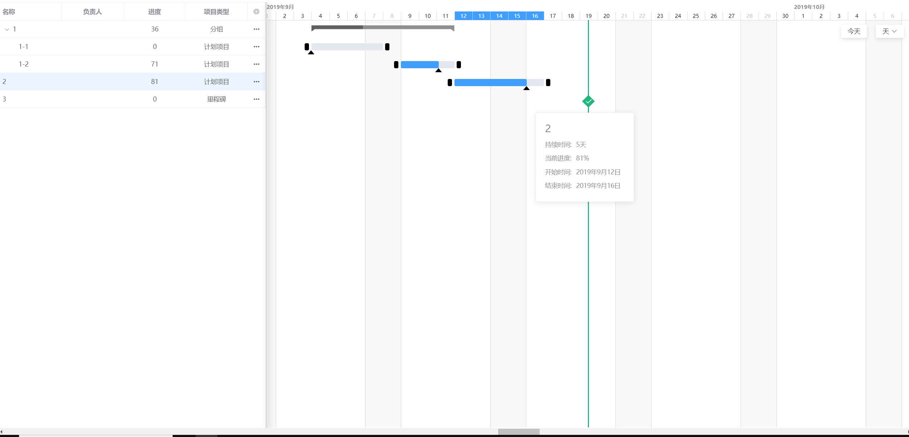

# Gantt

## 安装

```
yarn install
```

### 运行

```
yarn run serve
```

### 说明

```
基于vue开发的甘特图展现，这里的代码只有一部分，删除和编辑没有写。

支持分组
支持拖拽
支持拉伸
支持百分比
支持时间跨度：天，周，月
目前只写了一级分组，为了避免未来二级或者多级分组需求，在上一次提交中重构了部分代码，支持多级分组，但是当前版本没有开发

```

### 查看示例

See [demo](https://ggbeng1.github.io/Gantt/#/)

### 展示图


